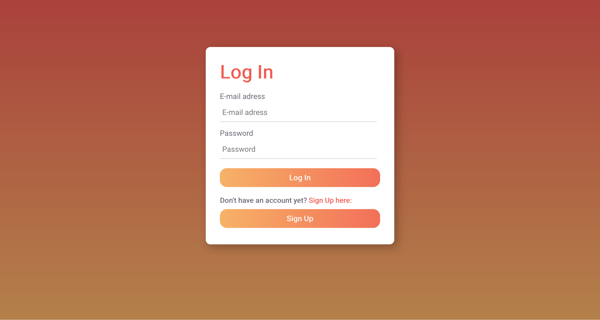
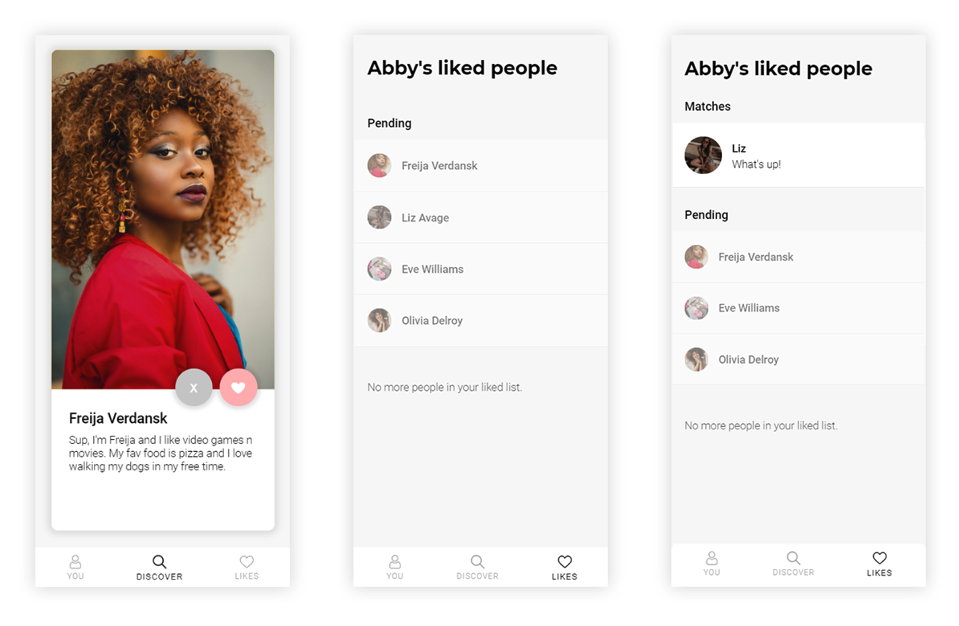

# ![Project-Tech - Examples][banner-examples]

## Table of Contents

- [Student examples](#student-examples)
- [Teacher examples](#teacher-examples)
- [External examples](#external-examples)

## Student Examples

### Wiki Examples

> There is an official™ blok tech wiki blueprint which you can find in [the wiki of this repository][wiki] (pt-course-20-21). It will get you up and running quickly with the minimum requirements for your documentation but **don't take it as is**. Add more topics and pages once you get going. 

### Individual Features

<table>
  <tr valign="top">
    <td width="25%"><a href="https://github.com/MartijnKeesmaat"><strong>@martijnkeesmaat</strong></a> </td>
    <td width="25%"><a href="https://github.com/iSirThijs"><strong>@iSirThijs</strong></a> </td>
    <td width="25%"><a href="https://github.com/emmaoudmaijer"><strong>@emmaoudmaijer</strong></a> </td>
  </tr>
  <tr valign="top">
    <td width="25%"><a href="https://github.com/BVictorB"><strong>@BVictorB</strong></a> </td>
    <td width="25%"><a href="https://github.com/dewarian/"><strong>@karimeij</strong></a> </td>
    <td width="25%"><a href="https://github.com/NathanNeelis/"><strong>@nathanneelis</strong></a> </td>
  </tr>
</table>

### Team Applications

<table>
  <tr valign="top">
    <td width="25%"><a href="https://github.com/kalemis"><strong>Muse</strong></a> </td>
    <td width="25%"><a href="https://github.com/StanBankras/"><strong>Amatch</strong></a> </td>
    <td width="25%"><a href="https://github.com/bbawuah"><strong>Pixby</strong></a> </td>
  </tr>
    <tr valign="top">
    <td width="25%"><a href="https://github.com/karimeij/"><strong>Wavy</strong></a> </td>
    <td width="25%"><a href="https://github.com/iSirThijs"><strong>@iSirThijs</strong></a> </td>
    <td width="25%"><a href="https://github.com/emmaoudmaijer"><strong>@emmaoudmaijer</strong></a> </td>
  </tr>
</table>

### Teacher Examples

_These are examples that teachers have written, look trough the commits to see the steps._

**Coming soon**

### External examples

_These are small examples  and repository other people have written._

#### GitHub

- [Sindre Sorhus his GitHub community files][community]
- [GitHub's community files][community-git]

#### Local Dev Environment
- [Danny's Dotfiles for setting up his local dev environment][dotfiles]
- [Wes Bos his No-Sweat™ Eslint and Prettier Setup][dotfiles]

[banner-examples]: https://cmda-pt.github.io/pt-course-20-21/assets/banner-examples.svg
[wiki]: https://github.com/cmda-bt/pt-course-20-21/wiki

[community]: https://github.com/sindresorhus/.github
[community-git]: https://github.com/github/.github
[dotfiles]: https://github.com/dandevri/dotfil.es